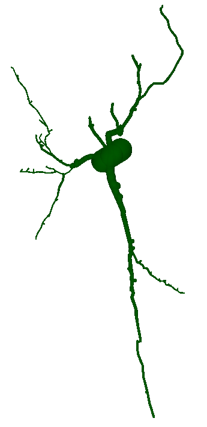

# NEUROMORPHO RECONSTRUCTION

This code provides a reconstruction method for NEUROMORPHO cells from the ".SWC" file format into
a set of spheres. 

## Installation

To use the following code, the packages in requirements.txt should be installed

```properties
pip install -r requirements
``` 

## Run example with plot:

To run a basic example with plot run the following command:

```properties
python SWCDataReconstruction --plot
``` 

To visualize the reconstruction for a given ".SWC" file, use the following command:

```properties
python SWCDataReconstruction --file_path "path_to_cell_fil.swc" --plot
``` 


### Example of reconstructed cell


